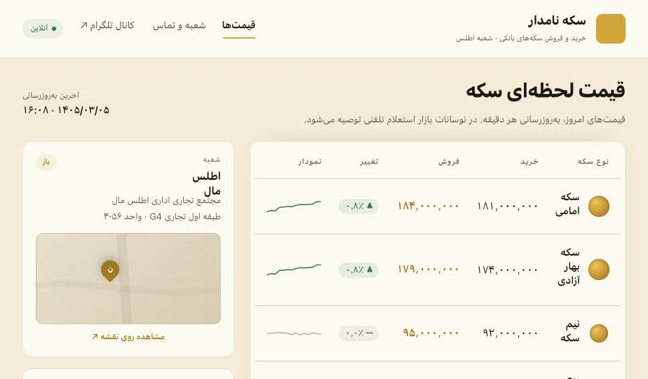
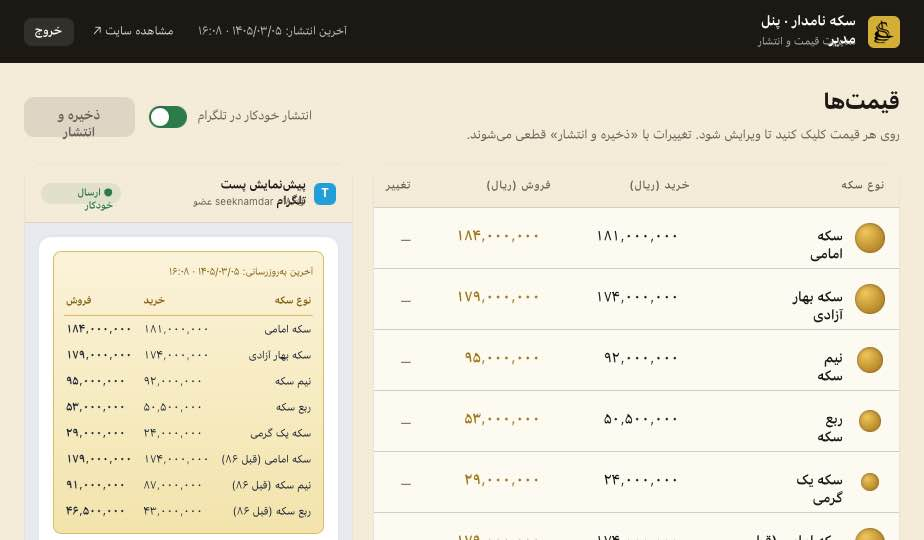

# Namdar Coin — سکه نامدار

A modern, real-time exchange rate and gold coin pricing website for **Namdar Coin** — a currency exchange and coin dealer based in Tehran, Iran.

Built as a full-stack project combining a live customer-facing pricing board with a secure admin dashboard for staff to update rates instantly.

---

## ✨ Features

- **Live pricing board** — exchange rates, gold coin prices, and buy/sell spreads updated in real time
- **Admin dashboard** — password-protected panel for staff to update prices without touching any code
- **Telegram bot integration** — automatically posts new rates to a connected Telegram channel whenever prices change
- **Price history** — keeps a log of rate changes visible to admins
- **Branch info & working hours** — contact details and opening hours displayed for customers
- **Responsive design** — works cleanly on mobile and desktop

---

## 🛠 Tech Stack

| Layer     | Technology                        |
|-----------|-----------------------------------|
| Frontend  | HTML / CSS / Vanilla JS           |
| Backend   | Node.js + Express                 |
| Auth      | JWT (JSON Web Tokens)             |
| Storage   | JSON flat files (no database needed) |
| Realtime  | Server-Sent Events (SSE)          |
| Bot       | Telegram Bot API                  |

---

## 🚀 Getting Started

### Prerequisites
- Node.js v18+
- A Telegram bot token (from [@BotFather](https://t.me/BotFather))

### Setup

```bash
# 1. Clone the repo
git clone https://github.com/your-username/namdar-coin.git
cd namdar-coin

# 2. Install backend dependencies
cd backend
npm install

# 3. Configure environment
cp .env.example .env
# Edit .env and fill in your JWT secret, admin password, and Telegram token

# 4. Start the server
node server.js
```

The app will be available at `http://localhost:3000`.

---

## ⚙️ Environment Variables

Copy `backend/.env.example` to `backend/.env` and set the following:

| Variable              | Description                              |
|-----------------------|------------------------------------------|
| `PORT`                | Server port (default: `3000`)            |
| `JWT_SECRET`          | Long random string for signing tokens    |
| `ADMIN_USERNAME`      | Admin panel login username               |
| `ADMIN_PASSWORD`      | Admin panel login password               |
| `TELEGRAM_BOT_TOKEN`  | Token from @BotFather                    |
| `TELEGRAM_CHANNEL`    | Channel username e.g. `@yourchannel`     |

> **Never commit your `.env` file.** It is listed in `.gitignore`.

---

## 📁 Project Structure

```
namdar-coin/
├── index.html              # Main customer-facing pricing page
├── Sekke Namdar.html       # Coin prices page
├── assets/
│   └── logo.jpg
├── screenshots/
│   ├── home.png
│   └── admin.png
└── backend/
    ├── server.js           # Express API + SSE + Telegram bot
    ├── .env.example        # Environment variable template
    ├── package.json
    └── data/
        ├── prices.json     # Current prices (runtime)
        ├── hours.json      # Working hours
        └── history.json    # Price change log
```

---

## 📸 Screenshots

### Customer Pricing Board


### Admin Dashboard


---

## 📄 License

This project is built for **Namdar Coin** — all rights reserved.
